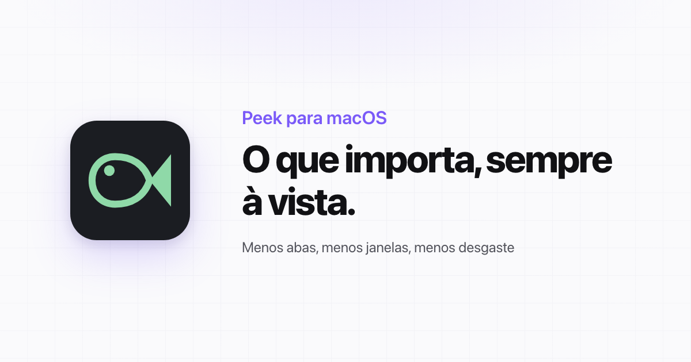
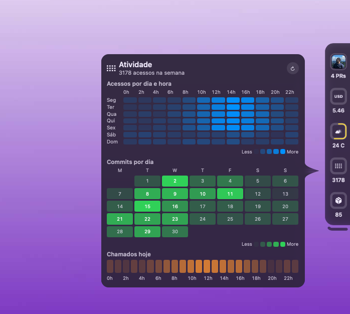

  

<h1 align="center">Plugins do Peek</h1>

  <a href="https://peek.marcelxsilva.dev">Site</a> ·
  <a href="https://peek.marcelxsilva.dev/plugins">Página de plugins</a> ·
  <a href="plugins/">Pasta de plugins</a> ·
  <a href="COMO-CRIAR.md">Como criar um plugin</a>

&nbsp;

## O que importa, sempre à vista

O Peek é um app para Mac que fica na borda da tela e mostra o que importa para o seu dia. As vendas de hoje, o pedido que chegou, o erro em produção, a luz da sala. Tudo num ícone, a um clique.

Você para de abrir abas para conferir as mesmas coisas. Passa o cursor e o cartão abre com os detalhes. Quando algo muda, o ícone salta de leve, como no Dock. Os botões resolvem ali mesmo, sem abrir outro app.

  

&nbsp;

## Por que o Peek

- **Menos abas, menos janelas.** O que você confere toda hora fica na borda da tela.
- **Avisa quando importa.** O ícone salta quando algo muda. Nada de pop-ups.
- **Resolve em um clique.** Ligue uma luz, rode um comando, copie um código, direto do cartão.
- **Seus dados no seu Mac.** Os tokens ficam nas Chaves do Mac e nada passa pelos nossos servidores.
- **Do seu jeito.** Comece de um plugin pronto e ajuste o que quiser, sem precisar programar.

&nbsp;

## Os plugins

Este repositório é o catálogo oficial de plugins do Peek. Cada plugin é um arquivo JSON que vira um ícone na borda da tela. Há plugins para quem desenvolve, para quem lidera e para o dia a dia: GitHub, Jira, HubSpot, Home Assistant, clima, cotações, notícias e muito mais.

Para instalar:

1. Encontre o plugin na [página de plugins](https://peek.marcelxsilva.dev/plugins) ou na [pasta `plugins/`](plugins/).
2. Clique em **Instalar**. O Peek abre com o plugin pronto para revisar.
3. Ou baixe o arquivo `.json` e importe em **Configurações › Plugins › Importar**.

Antes de instalar, o Peek mostra tudo o que o plugin lê e roda. Nada entra sem você ver.

&nbsp;

## Monte o seu

Não achou o que precisa? Um plugin se monta dentro do próprio Peek, com os dados de verdade na tela enquanto você escolhe o que mostrar. O cartão é feito de blocos: destaque, gráfico, mapa de calor, barras, etapas, distribuição, grade de status, linha do tempo, tabela, texto, lista, botões, propriedades, controles e abas. Também dá para descrever o que você quer ao seu modelo de IA e importar o arquivo que ele devolver.

[Veja como criar um plugin](COMO-CRIAR.md).

&nbsp;

## Experimente por 15 dias

Baixe o Peek e use tudo, sem limites, por 15 dias. Se ele deixar o seu dia mais leve, compre a licença vitalícia uma única vez.

**[Baixar o Peek](https://peek.marcelxsilva.dev)** · [Ver o preço](https://peek.marcelxsilva.dev/pricing)

Requer macOS 15 ou superior.

&nbsp;

## Para quem mantém o catálogo

- `plugins/`: um arquivo JSON por plugin.
- `index.json`: a lista que a página de plugins do site lê. Cada plugin novo entra aqui com nome, categoria, descrição e o que ele precisa para funcionar.
- `assets/`: as imagens deste repositório.

Feito com carinho no Brasil.

